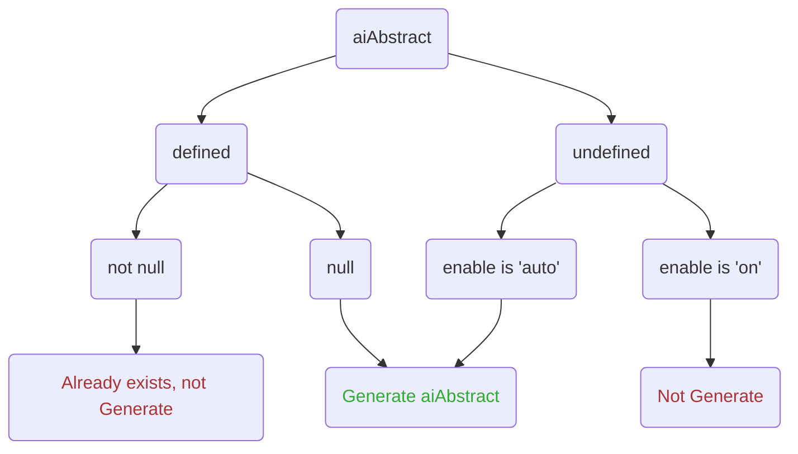

<div align="center">
<a name="readme-top"></a>

<h1> hexo-ai-abstract </h1>

A Hexo plugin to generate AI-based abstracts for your blog posts. Fix hexo-ai-excerpt.

[![CI status][github-action-image]](https://github.com/jankiny/hexo-ai-abstract/actions/workflows/npm-publish.yml)
[![NPM version][npm-image]](https://npmjs.org/package/hexo-ai-abstract)
[![NPM downloads][download-image]](https://npmjs.org/package/hexo-ai-abstract)
[](LICENSE)
</div>

[github-action-image]: https://github.com/jankiny/hexo-ai-abstract/actions/workflows/npm-publish.yml/badge.svg
[npm-image]: https://img.shields.io/npm/v/hexo-ai-abstract.svg?style=flat-square
[download-image]: https://img.shields.io/npm/dm/hexo-ai-abstract.svg?style=flat-square

## Features

 - [x] Core Functionality: AI Abstract Generation (using OpenAI API)
 - [x] Ignore Files via Tags
 - [x] Ignore Files via Title
 - [x] Ignore Files via Attribute
 - [x] Content Injection


## Installation

```bash
npm install hexo-ai-abstract
```

## How to use

Put `hexo_ai_abstract` config in your `hexo/_config.yml`.
```yaml
hexo_ai_abstract:
  enable: 'on' # ['auto', 'on', 'off']
  apiKey: 'your-api-keys here'
  apiUrl: 'https://api.openai.com/v1'
  model: 'gpt-4o-mini'
  prompt: 'You are a highly skilled AI trained in language comprehension and summarization. I would like you to read the text delimited by triple quotes and summarize it into a concise abstract paragraph. Aim to retain the most important points, providing a coherent and readable summary that could help a person understand the main points of the discussion without needing to read the entire text. Please avoid unnecessary details or tangential points. Only give me the output and nothing else. Do not wrap responses in quotes. Respond in the Chinese language.'
  ignoreEl: [
    'table', 'pre', 'figure'
  ]
  ignores:
    byTitle: [ '{{title}}' ]
    byTag: [ 'about', 'encrypt' ]
    byAttribute: ['password']
  inject: 
    anchor: '<!-- more -->'
    front: True 
  maxTokens: 5000
```

**Note:**
If `enable` is set to 'on', it indicates that the plugin is in test mode. 
For posts that are expected to generate AI abstract, the `aiAbstract` property should be added to their Front-Matter and must be ensured to be empty.

This plugin will upload `data.content` to the AI service to generate an abstract when you save a post without `excerpt` [Front-Matter](https://hexo.io/zh-cn/docs/front-matter).
The abstract will then be used to construct the excerpt.

The generated abstract will look like this:
```markdown
---
title: Your Post Title
tags:
  - notencrypt
aiabstract: >-
  Generated Abstract.
---
```

### 1. Test your `_config.yml`

You can set "enable" to "on" to test whether the plugin is working.
```yaml
hexo_ai_abstract:
  enable: 'on'
```

When "enable" is set to either "on" or "auto," the visualization results of the decision tree are as follows.



Specifically, when "enable" is set to "on," the AI summary generation will only be executed if the `aiAbstract` attribute of the post exists and is empty. 
Consequently, you can test the plugin's availability by adding the `aiAbstract` attribute to a post and leaving it empty.

### 2. Ignores

For some personal post, e.g. encrypted posts, uploading the post's content might be undesirable. 
To address this, `hexo-ai-abstract` offers features to "Ignore Files via Tags", "Ignore Files via Title" and "Ignore Files via Attribute".

**Ignore Files via Tags**

You can filter out posts that you don't want to process by tagging them accordingly. 
For example:
```markdown
title: Post Title
tags:
  - secret
```
Then, in your _config.yml, you can specify the tags to ignore:
```yaml
hexo_ai_abstract:
  ignores:
    byTag: [ 'secret', '...' ]
```
Any post tagged with a tag listed in ignoreTag will be skipped during the abstract generation process.

**Ignore Files via Title**

Some plugins and software may include post templates.
However, generating summaries from the content of these templates is generally undesirable.

To address this, the option to "Ignore Files via Title" has been introduced.
For example, using the "insect template" in Obsidian, if the post title is set to {{title}}:
```markdown
---
title: '{{title}}'
toc: true
recommend: 1
keywords: '{{title}}'
uniqueId: '{{date}} {{time}}/{{title}}.html'
...
```
You can specify in the `_config.yml` to ignore posts with the title "{{title}}":
```yaml
hexo_ai_abstract:
  ignores:
    byTitle: [ '{{title}}' ]
```
After that, the plugin will not generate AI abstract for these posts.

**Ignore Files via Attribute**

In the plugin `hexo-blog-encrypt`, you can encrypt posts not only by using tags but also by adding a `password` in the post attributes. 
Therefore, we have also incorporated the corresponding functionality.

For example, if a password is added to a post:
```markdown
---
...
comments: false
password: pa33w@rd
...
```
You should also specify the password in the `_config.yml`:
```yaml
hexo_ai_abstract:
  ignores:
    byAttribute: [ 'password' ]
```
Subsequently, the plugin will ignore this post.

### 3. Content Injection

In our initial version, the generated AI summaries were stored in the `excerpt` attribute. 
However, if there is content in the excerpt, the content before the `<!-- more -->` will not be displayed as an excerpt on the homepage, and the excerpt content cannot be rendered within the main body.

To address this issue, the `hexo-ai-abstract` plugin has implemented the following changes after `v1.1.0`:
 - The generated AI abstract is now stored in the `aiAbstract` attribute.
 - An injection feature has been added: the content from `aiAbstract` is injected into the main content.

This functionality requires you to add configuration settings in the `_config.yml`:
```yaml
hexo_ai_abstract:
  inject:
    anchor: '<!-- more -->'
    front: False
```

The plugin will first match the content in `inject.anchor` 
and then determine whether to inject the AI summary content before or after `inject.anchor` 
based on the `inject.front` setting.

Taking `anchor: '<!-- more -->'` as an example, 
if `front: True`, the AI summary will be generated before the `<!-- more -->` tag. 
Conversely, if `front: False`, the AI summary will be generated after the `<!-- more -->` tag.

## Acknowledgement

We sincerely thank [hexo-ai-excerpt](https://github.com/rootlexme/hexo-ai-excerpt) and [hexo-ai-summaries](https://github.com/tardis-ksh/hexo-ai-summaries) for their pioneering work, which served as an inspiration for the creation of hexo-ai-abstract.

## Licence

`hexo-ai-abstract` is released under the MIT License. 
You are free to use, modify, and distribute this software under the terms of the MIT License. 
We encourage contributions and feedback to help improve the project.

