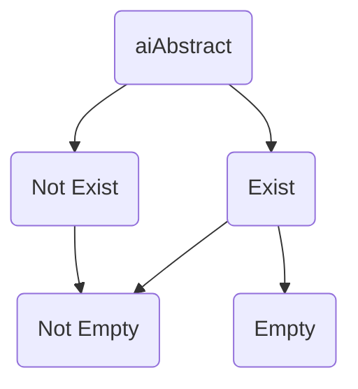

<div align="center">
<a name="readme-top"></a>

<h1> hexo-ai-abstract </h1>

A Hexo plugin to generate AI-based abstracts for your blog posts. Fix hexo-ai-excerpt.

[![CI status][github-action-image]](https://github.com/jankiny/hexo-ai-abstract/actions/workflows/npm-publish.yml)
[![NPM version][npm-image]](https://npmjs.org/package/hexo-ai-abstract)
[![NPM downloads][download-image]](https://npmjs.org/package/hexo-ai-abstract)
[](LICENSE)
</div>

[github-action-image]: https://github.com/jankiny/hexo-ai-abstract/actions/workflows/npm-publish.yml/badge.svg
[npm-image]: https://img.shields.io/npm/v/hexo-ai-abstract.svg?style=flat-square
[download-image]: https://img.shields.io/npm/dm/hexo-ai-abstract.svg?style=flat-square

## Features

 - [x] Base: AI Abstract Generation (OpenAI API)
 - [x] Ignore Files via Tags
 - [x] Ignore Files via Title
 - [x] Ignore Files via Attribute
 - [x] Inject to Content
 - [ ] Cache


## Installation

```bash
npm install hexo-ai-abstract
```

## How to use

Put `hexo_ai_abstract` config in your `hexo/_config.yml`.
```yaml
hexo_ai_abstract:
  enable: 'on' # ['auto', 'on', 'off']
  apiKey: 'your-api-keys here'
  apiUrl: 'https://api.openai.com/v1'
  model: 'gpt-4o-mini'
  prompt: 'You are a highly skilled AI trained in language comprehension and summarization. I would like you to read the text delimited by triple quotes and summarize it into a concise abstract paragraph. Aim to retain the most important points, providing a coherent and readable summary that could help a person understand the main points of the discussion without needing to read the entire text. Please avoid unnecessary details or tangential points. Only give me the output and nothing else. Do not wrap responses in quotes. Respond in the Chinese language.'
  ignoreEl: [
    'table', 'pre', 'figure'
  ]
  ignores:
    byTitle: [ '{{title}}' ]
    byTag: [ 'about', 'encrypt' ]
    byAttribute: ['password']
  inject: 
    anchor: '<!-- more -->'
    front: True 
  maxTokens: 5000
```

This plugin will upload `data.content` to the AI service to generate an abstract when you save a post without `excerpt` [Front-Matter](https://hexo.io/zh-cn/docs/front-matter).
The abstract will then be used to construct the excerpt.

The generated abstract will look like this:
```markdown
---
title: Your Post Title
tags:
  - notencrypt
aiabstract: >-
  Generated Abstract.
---
```

### 1. Test your `_config.yml`



### 2. Ignores

For some personal post, e.g. encrypted posts, uploading the post's content might be undesirable. 
To address this, `hexo-ai-abstract` offers a feature to "Ignore Files via Tags", "Ignore Files via Title" and "Ignore Files via Attribute".


You can filter out posts that you don't want to process by tagging them accordingly. 
For example:
```markdown
title: Post Title
tags:
  - secret
```
Then, in your _config.yml, you can specify the tags to ignore:
```yaml
hexo_ai_abstract:
  ignoreTag: [
    'secret', '...'
  ]
```
Any post tagged with a tag listed in ignoreTag will be skipped during the abstract generation process.

## Acknowledgement

We sincerely thank [hexo-ai-excerpt](https://github.com/rootlexme/hexo-ai-excerpt) and [hexo-ai-summaries](https://github.com/tardis-ksh/hexo-ai-summaries) for their pioneering work, which served as an inspiration for the creation of hexo-ai-abstract.

## Licence

`hexo-ai-abstract` is released under the MIT License. 
You are free to use, modify, and distribute this software under the terms of the MIT License. 
We encourage contributions and feedback to help improve the project.

